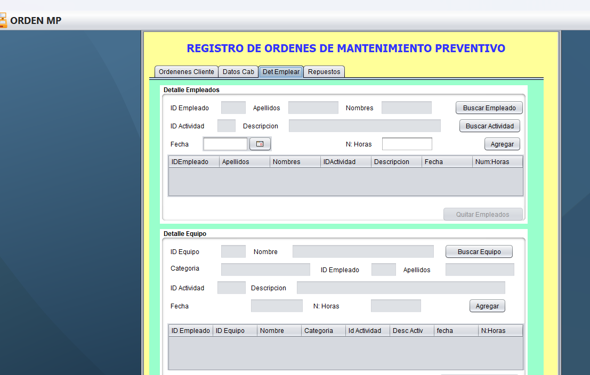
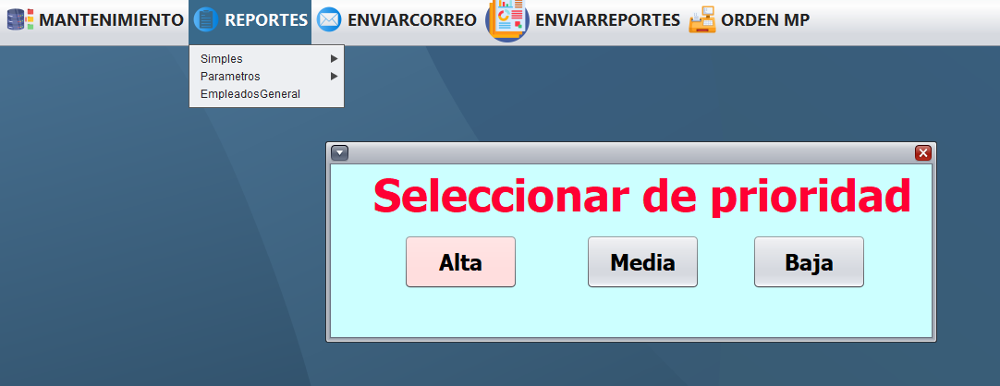
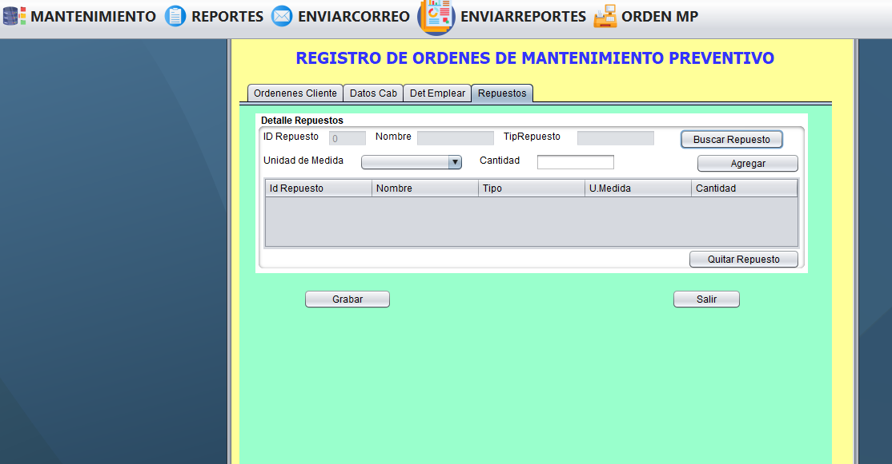
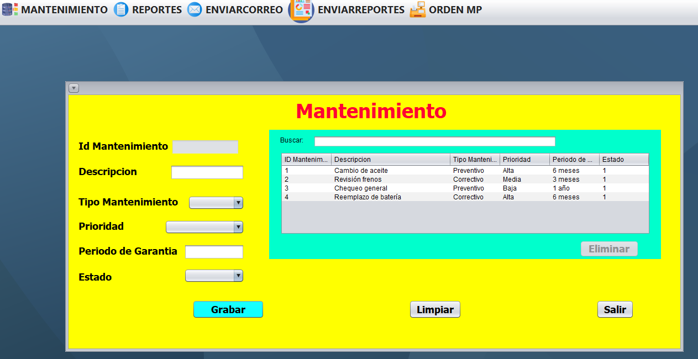
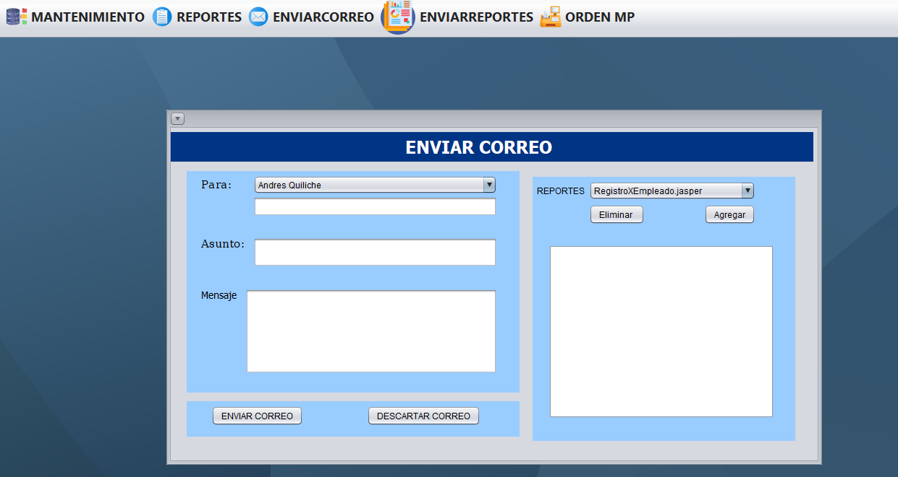
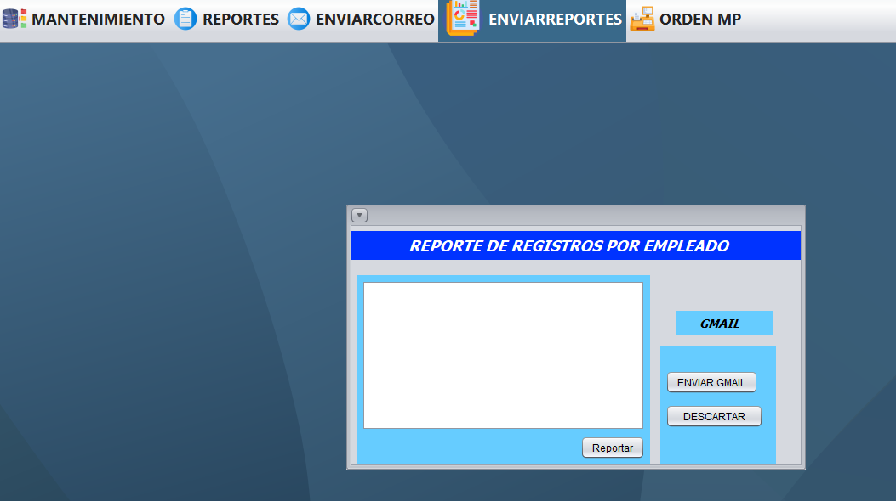
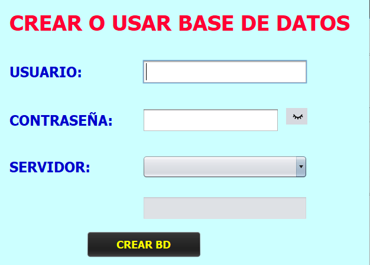

# Java Project: Car Repair Management System

This is a Java project focused on managing table maintenance, specifically designed for transactions in a car repair business. The project provides functionalities to add, update, and manage different tables related to the business operations.

## About the Project
This project was developed by me and my university group as part of the course **Object-Oriented Programming**. The main objective was to apply OOP principles to create a system capable of handling maintenance tasks for various tables.

### Features
- CRUD operations for multiple tables (e.g., Customers, Services, Vehicles).
- Transaction management for car repairs.
- Report of the transaction sent via email to the workers.
- The project distinguishes between admin and worker roles, ensuring each has access to their respective functionalities.
- If the database is not created, this project creates one automatically.

## Screenshot
These are some images of the project:

  
  
  
  
  
  
  
  

